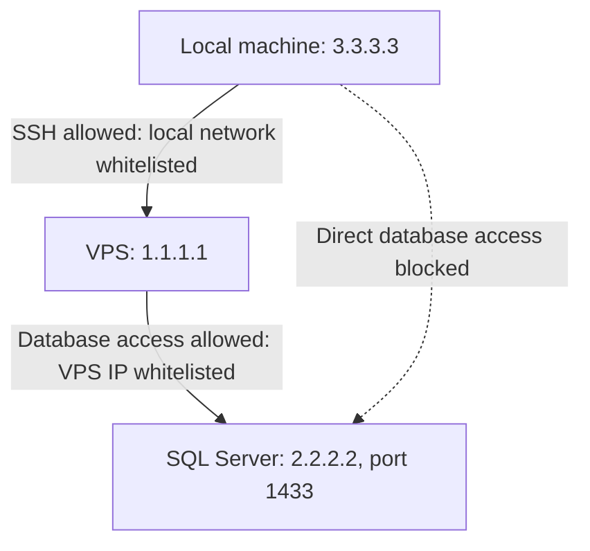
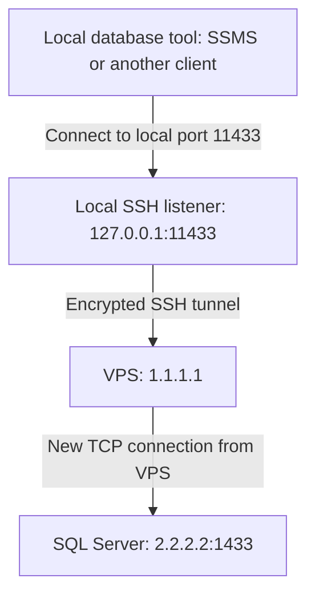

I needed to connect to our SQL Server database from my local machine, but the database only allowed connections from our VPS. I used SSH local port forwarding to connect through the VPS while continuing to use my local database tools.

## The setup

The IP addresses below are placeholders for this example.

| Machine | IP address | Access rules |
|---|---|---|
| VPS | `1.1.1.1` | Accepts SSH connections from our local network and can reach the database. |
| Database server | `2.2.2.2` | Allows database connections only from `1.1.1.1`. |
| Local machine | `3.3.3.3` | Our local network is whitelisted for SSH access to the VPS. |

Connecting directly from my machine to the database was blocked. However, I already had an allowed SSH connection to the VPS, and the VPS had an allowed connection to the database.



## Creating the temporary tunnel

I ran this command on my local machine:

```bash
ssh -N \
  -i key.pem \
  -L 127.0.0.1:11433:2.2.2.2:1433 \
  -o ExitOnForwardFailure=yes \
  -o ServerAliveInterval=30 \
  -o ServerAliveCountMax=3 \
  username@1.1.1.1
```

Replace `username` with the VPS SSH account. This example assumes SQL Server listens on TCP port `1433`; use its actual port if different. The multiline command uses Bash syntax. In PowerShell or Command Prompt, run it on one line:

```text
ssh -N -i key.pem -L 127.0.0.1:11433:2.2.2.2:1433 -o ExitOnForwardFailure=yes -o ServerAliveInterval=30 -o ServerAliveCountMax=3 username@1.1.1.1
```

The tunnel listens on `127.0.0.1:11433` on my machine. Whenever a local tool connects to that address, SSH carries the connection to the VPS, which opens a TCP connection to `2.2.2.2:1433`.



The database sees the VPS's outbound IP, `1.1.1.1`, rather than my local network's IP. This assumes the VPS uses `1.1.1.1` for outbound database connections; a NAT gateway or different route could change that address.

## What the SSH options do

| Option | Purpose |
|---|---|
| `-N` | Runs the tunnel without executing a remote command or opening a shell. |
| `-i key.pem` | Uses `key.pem` as the SSH private key. |
| `-L 127.0.0.1:11433:2.2.2.2:1433` | Forwards local port `11433` to the database's port `1433` through the VPS. Binding to `127.0.0.1` limits access to my machine. |
| `-o ExitOnForwardFailure=yes` | Exits if the forwarding listener cannot be set up, such as when local port `11433` is occupied. It does not verify database reachability. |
| `-o ServerAliveInterval=30` | Sends an SSH liveness check after 30 seconds without receiving data from the SSH server. |
| `-o ServerAliveCountMax=3` | Disconnects after three unanswered checks, approximately 90 seconds of an unresponsive SSH connection. |
| `username@1.1.1.1` | Identifies the SSH account and VPS address. |

SSH forwarding must be permitted on the VPS. I did not need to open port `11433` on the VPS: that listener exists on my local machine.

I kept the terminal running while using the database and pressed **Ctrl+C** when finished to close the tunnel. SSH encrypts the local-to-VPS leg; database TLS should remain enabled to protect the VPS-to-database leg as well.

## Connecting with SSMS or another local tool

With the tunnel running, I pointed my local database client at the forwarded port instead of the database's remote IP.

In **SQL Server Management Studio (SSMS)**:

1. Open **Connect to Server** and select **Database Engine**.
2. Enter `tcp:127.0.0.1,11433` in **Server name**.
3. Select the authentication method supported by the database and enter the usual database credentials.
4. Click **Connect**.

SQL Server's server-name syntax uses a **comma** before the port: `tcp:127.0.0.1,11433`.

For tools that provide separate connection fields, I used:

| Setting | Value |
|---|---|
| Database type | SQL Server |
| Host | `127.0.0.1` |
| Port | `11433` |
| Database | The required database name |
| Authentication | The database's usual authentication method and credentials |

The SSH login and database login remain separate. The tunnel provides network connectivity; SQL Server still authenticates the database session.

If certificate validation fails because the client connects to `127.0.0.1`, configure the client's expected certificate hostname to match the database certificate, where supported. Keep the existing database encryption and certificate validation requirements.

My local tool then worked through the tunnel, with the database connection originating from the whitelisted VPS.

## References

- [OpenSSH manual: local port forwarding and SSH options](https://man.openbsd.org/ssh)
- [Microsoft Learn: connecting to the SQL Server Database Engine](https://learn.microsoft.com/en-us/sql/sql-server/connect-to-database-engine)
